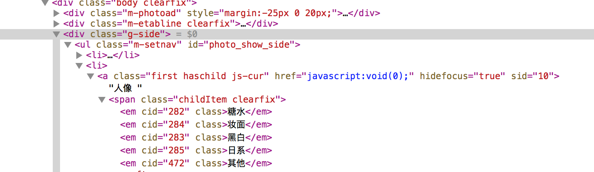
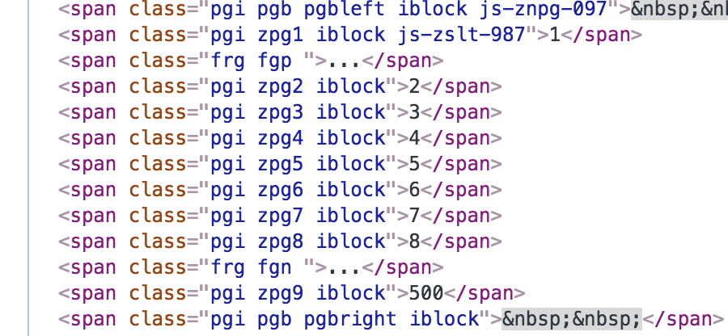
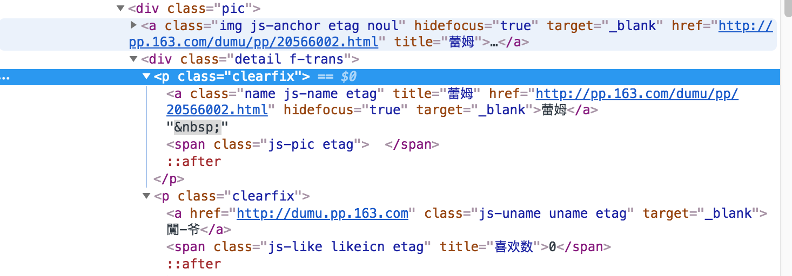
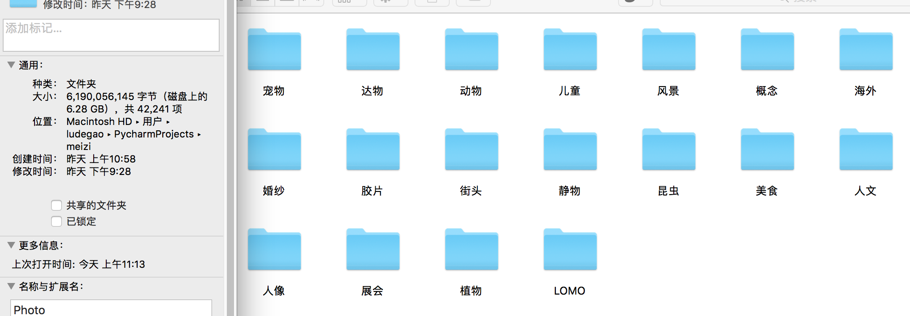

### 爬虫实战练习

- 分别类爬取网易摄影的图片
- 解决地址污染问题
- 不被服务器拒绝、超时链接异常处理办法
- 可以随时关闭，然后随时运行

前部分知识参见：爬虫教程，本章节直接解释代码

#### 导入模块

- selenium+Phantomjs的组合，如何安装，自行百度
  - selenium一定要装2.48这个版本
- os模块负责文件的处理与写入

```python
#encoding=utf-8
from selenium import webdriver      
import requests
from bs4 import BeautifulSoup
import time
import os
import random

```
- Translator 模块可以给我们带来谷歌翻译的api
- 编辑headers的请求头可以为我们减少不必要的麻烦
  - `Connection:close`可以帮助我们解决链接一些重复链接与超时的问题

```python
# 谷歌翻译模块，为我们建立目录做准备
from googletrans import Translator
translator = Translator(service_urls=[
      'translate.google.cn',
    ])
# img_title = translator.translate(img['title']).text

# requests请求头
headers = {
    'Connection': 'close',
    'User-Agent': 'Mozilla/5.0 (Macintosh; Intel Mac OS X 10_13_6) AppleWebKit/537.36 (KHTML, like Gecko) Chrome/68.0.3440.106 Safari/537.36'
}
```

#### selenium模块的参数设置

- 关闭图片加载适用于不需要爬取图片的场合

```python
# 定位Phantom.js 的参数设置
service_args=[]
#service_args.append('--load-images=no')        ## 关闭图片加载
service_args.append('--disk-cache=yes')         ## 开启缓存
service_args.append('--ignore-ssl-errors=true') ## 忽略https错误
service_args.append('--ssl-protocol=any')       ## 防止网站无法解析
# 初始化PhantomJS
d = webdriver.PhantomJS(service_args=service_args)
```

- 构造函数`Ge_url`来得到具有js加载的网页源代码

```python
# 使用Phantom.js 读取信息函数
def Get_url(url):
    try:
        d.get(url)
    except:
        print('please wait 120 seconds')           # 如果出现异常，则等待120s，重启读取
        # d.quit()
        time.sleep(120)
        d.get(url)
        print('Connection Rest')
    time.sleep(1)
    sp = BeautifulSoup(d.page_source, "html5lib")  # html5解析网页
    d.get('about:blank')                           # 这个很关键，防止出现链接污染
    return sp                                      # 返回解析过后的网址源码
```

其中` d.get('about:blank')   `这一行命令很有意思，可以防止出现链接污染，关于为什么以及更多的性能优化，参照

[nMask's Blog:Phantomjs性能优化](https://thief.one/2017/03/01/Phantomjs性能优化/)

#### 程序的开始

```python
# 程序开始计时
start = time.clock()

# 首先来到人像页面
url = 'http://pp.163.com/pp/#p=10&c=-1&m=3&page=1'
html = requests.get(url).text
sp = BeautifulSoup(html,'html5lib')
```

首先我们来到的是一个界面:

找到页面之间的关联之处



我们不难发现，其中`sid=10`和`cid=282`管理着网址的分类，下方所示的`class ="pgi zpg9 iblock"`代表着网址的页码，我们可以再看一下网址url

- url = 'http://pp.163.com/pp/#p=10&c=-1&m=3&page=1'

不难得到，其中`p=10`和`sid`的值一致，`c=-1`与`cid`的值一致，`page=1`与`class ="pgi zpg9 iblock"`一致



自然，我们便有了一个初步的思路

- 首先得到分类：名称与网址
- 根据对应的参数，一步一步的进入到分类之中，再考虑如何下载

#### 分类

```python
# 找到二级分类
l = sp.find('ul',{"class": "m-setnav"}).find_all('a')
# 初始化字典
u = []
t = []
del l[0],l[-2],l[-1]      # 去除头尾的："全部"与"精选"

for o in l:
    # 大分类从这里获取
    u.append(o['sid'])
    t.append(o.text[0:4].strip('\n\t'))
```

这里我们去除头与尾部，便可以得到全部的对应关系

- `u`列表存放的是所有的`sid`的值
- `t`列表存放的是所有的分类对应的名称

#### 随时开关程序

为了做到随时开关这个下载爬虫，不会重复下载图片，我的处理是将一些关键词存入新打开的`***.txt`文档中，读取也是一样，首先先介绍函数，为了方便起见，我将所有的文档中的关键词`key`都用数字代表

- 关于写入文本的不同模式，可以查询相关百度

```python
# 将页码信息写入，以用重复查阅
def write_sth(txt,sth):
    with open(txt, 'w') as f:
        f.write("%s" % sth)
        f.close()

# 将页码信息读取
def read_sth(txt):
    if os.path.exists(txt) is True:
        with open(txt) as f:         # 默认模式为‘r’，只读模式
            content = int(f.read())  # 读取文件全部内容
            return content
    else:
        return 0                     # 因为列表的第一个元素的位置是[0]，所有返回0
```

于是在最大的分类循环开始之前，我们先读取一下

```python
# 读取存入的分类信息
cater_num = read_sth('num.txt')
```

#### 循环架构

关于总体架构，我的设计算法是这样的，采用的是一种线性结构

- 进入分类循环
  - 写入标签
  - 建立第一级目录
  - 判断是否存在次级网址与目录
    - 是
      - 读取次级网址与目录
      - 写入第二个关键参数
      - 构造第二级目录
      - 对该人像依据喜欢数进行分类文件夹的构造
      - 下载图片
    - 否
      - 下载图片

下图便是流程的代码

```python
# 主程序，也是最大的循环
for i in range(cater_num,len(u)):
    # 写入标签循环
    write_sth('num.txt',i)
    # 建立第一级目录
    base = './Photo/%s' % t[i]

    Create_list(base,t[i])

    # 如果存在次级网址与目录，则运行这一考虑
    if 'cid' in str(l[i]):
        childItem = l[i].find_all('em')

        # 读取存入的次级目录信息
        child_num = read_sth('child.txt')    

        for j in range(child_num,len(childItem)):

            child = childItem[j]

            # 写入标签循环
            write_sth('child.txt', j)

            url_cater = url.replace('p=10', 'p=%s' % u[i])

            # 第二级目录构建
            Second_list = base +'/'+child.text

            Create_list(Second_list,child.text)
            # 第三级目录构建

            Create_love(Second_list)

            # 切换到最终的网址
            url_cater = url_cater.replace('c=-1','c=%s' %child['cid'])
            Get_Download(url_cater,Second_list)

    else:
        url_cater = url.replace('p=10', 'p=%s' % u[i])
        # 切换到最终的网址
        Get_Download(url_cater, base)
```

这里面涉及到了两个函数，构造目录`Create_list`与下载图片`Get_Download`

首先介绍构造目录函数`Create_list`

- 关于`mkdir`与`makedirs`之间的区别，这里便不谈了

```python
# 建立一个目录
def Create_list(filename,name):
    if os.path.exists(filename) is True:
        print("%s finder have been existed" % name)
    else:
        os.mkdir(filename)
        print("%s finder have been created" % name)
    return

# 点赞数建立复杂目录
def Create_love(base):
    lis =[100,200,500,800,1000]
    # 只有人像进行了分类，其他的至少是喜欢数>200以上的
    for i in range(len(lis) - 1):
        what = '%s-%s' % (lis[i], lis[i + 1])
        Love = base + '/' + what
        Create_list(Love, what)
    return
```

#### 下载函数

这可能是这里面最重要也是最核心的函数了，很长，但是我们可以将其分为几部分

- 获取源码

```python
# 得到网址源码，开始获取信息
sp = Get_url(url_cater)
```

- 遍历所有页码数

```python
# 首先遍历所有页码数
page_all = int(sp.find("span", {"class": "pgi zpg9 iblock"}).text) + 1
```

- 从文本中读取已下载的页码

```python
# 读取已下载到的页码
page_num = 'page_num.txt'
contents = read_sth(page_num)
```

- 遍历页码`for page in range(contents, page_all):`

  - 运行时钟，每一页检查运行时间

  - 输出一系列提示语
    - 目前的总分类目录；
    - 子目录；
    - 页码
  - 将页码写入

  ```python
  end = time.clock()
  print('程序已运行:%s'%end)
  print('目前的目录是:%s'%t[i])
  
  # 判断是否存在子目录
  if 'cid' in str(l[i]):       
      print('子目录为：%s' %child.text)
  	
      # 将页码信息写入，以用重复查阅
      print('This is page:%s'%page)
      write_sth(page_num,page)
  ```

  - 读取页码时的小技巧
    - 一般我们的初始网页页码都是1

  ```python
  if page == 1:
      print('begin from 1')
      #pass
      else:
          img_page = url_cater.replace("page=1", "page=%s" % page)
          print(img_page)
          # 开始读取不同Page的信息
          sp = Get_url(img_page)
  ```

- 下载图组之前的处理：

  - 得到图组名字、摄影师名字、构造文件夹名字，并将相关摄影师信息写入
    - 字符串处理技巧：去除`/`这种符号

  ```python
  # 每个小图组内含信息
  sp_group = sp.find_all('div', {"class": "detail f-trans"})
  for group in sp_group:
  
      # 网址信息
  
      img_url = group.find('a', {"class": "name js-name etag"})['href']   # 图组的网址
      Phrog_url = group.find('a', {"class": "js-uname uname etag"})['href'] # 摄影师主页
  
      # 名字信息，并进行一些防处理：去除'/',缩短我们所用的长度
  
      Couimg_name = group.find('a', {"class": "name js-name etag"}).text.replace('/','_')    # 图组的名字
      Phrog_name = group.find('a', {"class": "js-uname uname etag"}).text.replace('/','_')   # 摄影师名字
  
      finder_name = '%s_%s' % (Couimg_name[0:12], Phrog_name[0:2])                           # 文件夹名字
  ```

  - 根据图组的喜欢数，可以得到一个小型过滤器

  

  - 上面这张图，便很好的阐释了我们的想法
    - 我针对存在子目录的人像分类，分别建立了`100-200`,`200-500`,`500-800`,`800-`四个文件夹，便于我之后的摄影学习

  ```python
  # 这里会遇到空字符串的问题
  love_label = group.find('span', {"class": "js-like likeicn etag"}).text
  if love_label == '':
      love_num = 0
      else:
          love_num = int(love_label)
  
  # 建立文件夹
  img_path_finder = base_path + '/' + finder_name
  
  if 'cid' in str(l[i]):
      if 100 <= love_num < 200:
          img_path_finder = base_path + '/100-200/' + finder_name
      elif 200 <=love_num < 500:
          img_path_finder = base_path + '/200-500/' + finder_name
      elif 500 <= love_num < 800:
          img_path_finder = base_path + '/500-800/' + finder_name
      elif 800 <= love_num :
          img_path_finder = base_path + '/800-1000/' + finder_name
      elif love < 100:
          continue
  else:
      if love_num >= 500:
          img_path_finder = base_path + '/' + finder_name
      else:
          continue
  ```

  - 构造文件夹

  ```python
  # 检查文件夹是否存在，如果存在，则换下一个
  if os.path.exists(img_path_finder) is True:
      print("%s finder have been existed" % finder_name)
  else:
      os.mkdir(img_path_finder)
      print("%s finder have been created" % finder_name)
      print(img_path_finder)
  
      # 将摄影师相关信息写入，以便后期查看摄影师主页
      Pho = img_path_finder+'/'+'Pho.txt'
      with open(Pho, 'w') as f:
          f.write("%s" % Phrog_url)
          f.close()
  ```

- 进入图组并下载

  - 进入图组url、获取所有图片网页的信息
    - `time.sleep(random.uniform(0.05,0.1))`这种请求间隙很重要

  ```python
  # 进入图组
  try:
      s = BeautifulSoup(requests.get(img_url,headers=headers).text, 'html5lib')
  except requests.exceptions.ConnectionError:
      print('ConnectionError -- please wait 120 seconds')
      time.sleep(120)
      s = BeautifulSoup(requests.get(img_url, headers=headers).text, 'html5lib')
      print('Connection Rest')
      
  time.sleep(random.uniform(0.05,0.1))
  
  # 找到图库的所有图片
  
  img_pic = s.find_all('div', {"class": "pic-area"})
  
  for pic in img_pic:
      imgs = pic.find_all('img')
      for img_image in imgs:
          url = img_image['data-lazyload-src']
          try:
              r = requests.get(url, stream=True,headers=headers)
          except requests.exceptions.ConnectionError:
              print('ConnectionError -- please wait 120 seconds')
              time.sleep(120)
              r = requests.get(url, stream=True, headers=headers)
              print('Connection Rest')
              time.sleep(random.uniform(0.05,0.1))
  
              # 图片文件命名
              image_name = url.split('/')[-1]
              # 图片文件路径
              img_path = img_path_finder + '/%s' %image_name
  ```

  - 下载（下载注意事项在之前的Phantomjs设置中查看）

  ```python
  # 图片文件下载
  if os.path.exists(img_path) == True:
      print("pass")
      #pass
  else:
      with open(img_path, 'wb') as f:
          for chunk in r.iter_content(chunk_size=128):
              f.write(chunk)
  ```

  - 页码全部下载完成后重置页码

  ```python
  # 页码寻找重启函数
  def Page_Reset():
      page_num = 'page_num.txt'
      with open(page_num, 'w') as f:
          f.write("1")
          f.close()
          
  # 恢复初始页码
  Page_Reset()
  print('End with %s'%page_all)
  ```

#### 结果丰收


